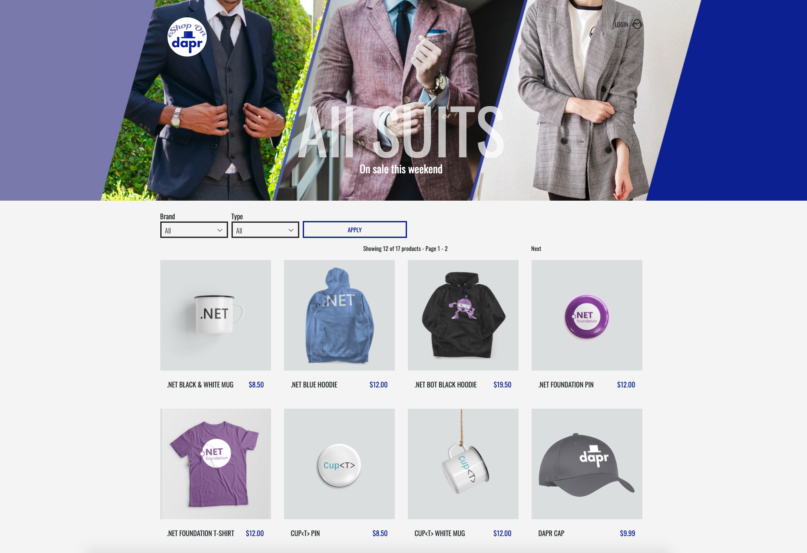

# eShop on Dapr

A sample .NET Core distributed application, powered by [Dapr](https://dapr.io/) building blocks, based on *[eShopOnContainers](https://github.com/dotnet-architecture/eShopOnContainers)*. 

Dapr enables developers using any language or framework to easily write microservices. It addresses many of the challenges found that come along with distributed applications, such as:

- How can distributed services discover each other and communicate synchronously?
 - How can they implement asynchronous messaging? 
 - How can they maintain contextual information across a transaction?
 - How can they become resilient to failure?
 - How can they scale to meet fluctuating demand?
 - How are they monitored and observed?

The code in this repository is work in progress. An accompanying e-Book called *Dapr for .NET developers* is currently in development and will use the sample code in this repository to demonstrate Dapr features and benefits.

## Getting started

1. eShopOnDapr runs in containers and requires Docker to run. To start the application:
   - Go to directory `deploy/compose`.
   - Create and start the containers: `docker-compose up`

2. It may take a little while to start all containers. eShopOnDapr includes a health UI that you can use to see if the containers are ready. You can access it at `http://host.docker.internal:5107/hc-ui`.

3. You can access the Web UI at `http://host.docker.internal:5104/`.

> Support for K8s deployments is on the roadmap.

## Roadmap

- [ ] Deployment
  - [x] Standalone: Docker Compose
  - [ ] K8s
- [x] Service invocation
- [x] Pub/sub
- [x] State management
- [ ] Secrets
  - [x] in configuration files
  - [ ] in .NET startup code
- [x] Observability
- [ ] Actor model
- [ ] Bindings

### Attributions

Model photos by  [Laura Chouette](https://unsplash.com/@laurachouette?utm_source=unsplash&utm_medium=referral&utm_content=creditCopyText), [Heng Films](https://unsplash.com/@hengfilms?utm_source=unsplash&utm_medium=referral&utm_content=creditCopyText) & [Enmanuel betances Santos](https://unsplash.com/@enmanuelbs?utm_source=unsplash&utm_medium=referral&utm_content=creditCopyText) on  [Unsplash](https://unsplash.com/photos/HqtYwlY9dxs?utm_source=unsplash&utm_medium=referral&utm_content=creditCopyText).
