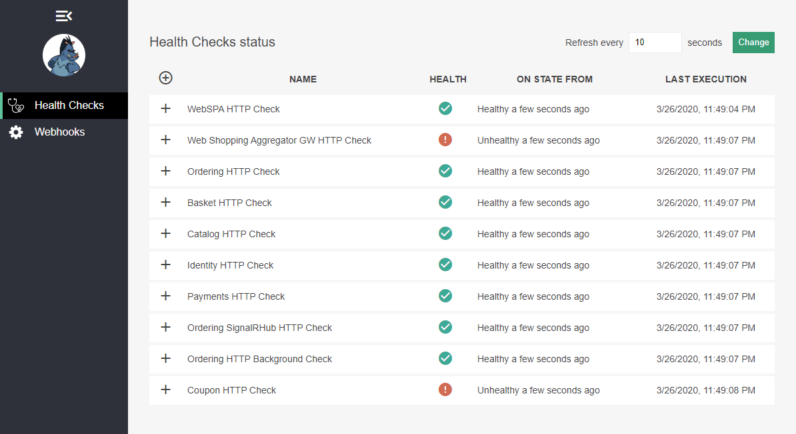
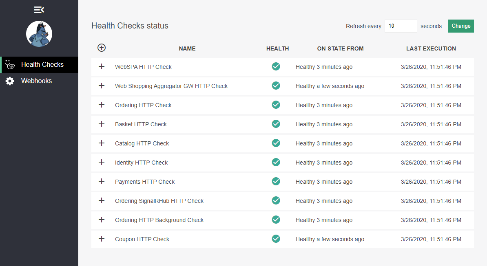
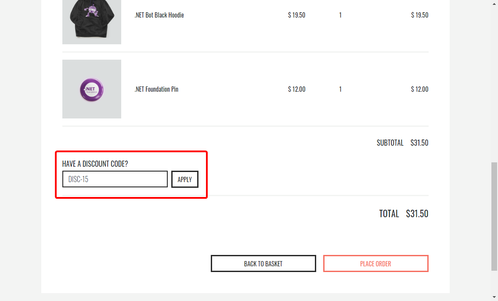

# eShop-Learn

eShop Sample for MS Learn

## Summary

This README guides you through the process to add a discount coupon feature to [eShopOnContainers](https://github.com/dotnet-architecture/eShopOnContainers).

These are high-level steps:

1. Deploy an AKS cluster with the base application

2. Set up a private registry in ACR

3. "Implement" the coupon service and related changes

4. Deploy changes

The real code changes have already been implemented, and there are a few that just need uncommenting some lines. You can do that by yourself or just run a script that does it for you.

You can run the whole process from the [Azure Cloud Shell](https://docs.microsoft.com/azure/cloud-shell/overview) in bash mode, without any other local resource. You'll need an Azure subscription and you can create a free one in few seconds if you need it.

It should take you less than an hour to get the final result. You'll need more than that, or course, to get the grasp of the concepts involved.

### Discount Coupon features

- The user can apply a discount coupon code during the checkout (**DISC-##**, where ## is the discount amount to the order total. For $5, $10, $15, $20, $25, and $30).
- The coupon service must confirm that the coupon is available and return the discount amount (REST API).
- The ordering microservice will request validation for the coupon, during the order process (Asynchronous messaging).
- Upon validation, the coupon will be assigned to the order and won't be available for any other order. However the coupon can be initially "used" by more than one order, until it's actually "consumed" during the order process.
- If the coupon validation is rejected for another order it'll be cancelled.
- If an order is cancelled because of payment rejection (will happen if the order total exceeds $100, configurable), the assigned coupon, if there was one, should be released for any other order to use.

## Steps

### 1. Deploy an AKS cluster with the base application

- Follow the [quickstart](deploy/k8s/README.md) guide to create an AKS with the base images from "[eshoplearn](https://hub.docker.com/orgs/eshoplearn/repositories)" in DockerHub.
- The base images contain most of the discount coupon-related features in the required microservices, but they are not available right away.

### 2. Set up a private registry in ACR

- Go to directory `deploy/k8s`.
- Run the `./create-acr.sh` script.

### 3. "Implement" the coupon service and related changes

There are several changes needed to add the discount coupon service, and everything is already implemented, there are just a few of them that are left for you to "implement" by running a script, and thus are marked as (***scripted***):

1. **Create the coupon service**
   - REST API.
   - Asynchronous messaging with integration events.
     - Assign to order on validation.
     - Release when order is cancelled.

2. **Include the discount coupon validation in the SPA**
   - Add the discount coupon field in the checkout view (***scripted***).
   - Get the discount coupon amount.
   - Show the discount amount in the order details view (***scripted***).

3. **Include the discount coupon verification in the order process**
   - Request coupon validation and assignment using asynchronous messaging.

4. **Deployment-related changes**
   - Create the Helm chart for the coupon service (***scripted***).
   - Add the coupon service as an authorized client in the identity microservice.
   - Add the coupon service routes to the API gateway.
   - Add the coupon service endpoints in the aggregator (***scripted***).
   - Add the coupon service as a health check dependency in the aggregator (***scripted***).
   - Add the coupon service as a health check item in the webstatus application (***scripted***).

To "implement" the marked changes:

- Go to directory `deploy/k8s`.
- Run the `./implementation-script.sh` script.

You can easily find all the lines that'll be changed by searching for `DISCOUNT-COUPON-COMMENT`

### 4. Deploy changes

In the previous step we changed some code and some configuration files, so to deploy the changes we have to:

1. Build new images for the changed applications and push them to the ACR.
   - Go to directory `deploy/k8s`.
   - Run the `./build-to-acr.sh` script.

2. Deploy the new coupon service and the changed services.
   - Go to directory `deploy/k8s`.
   - Run the `./update-aks.sh` script.

A few seconds after running the `update-aks.sh` script you should see something like this in the webstatus page:

And after two or three minutes you should see all services running again:

At this point you should be able to see the discount code field in the checkout page, like this:

## Homework

You've gone, very briefly, through the process of adding a new pre-implemented feature to eShopOnContainers. However to get a better grasp of the concepts and processes presented here it would be great that you tried implementing some features on your own, for example:

- Add an endpoint to create more discount coupons.
- Add a feature to handle several coupons with the same code.
- Display the reason for order cancellation in the order list.

Happy coding! 😉
