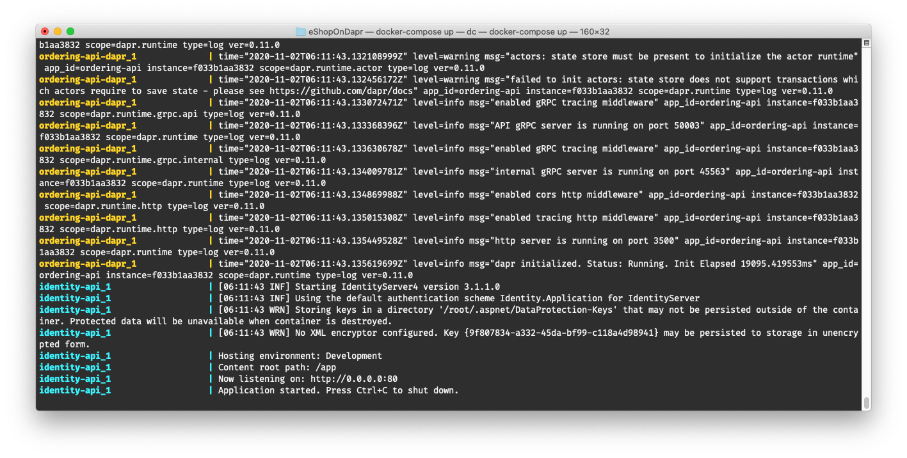
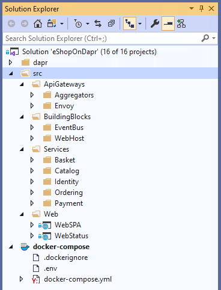
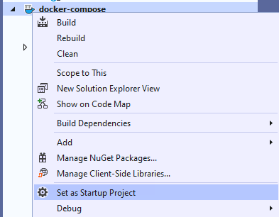
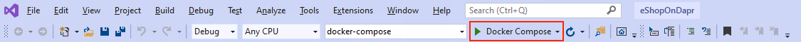
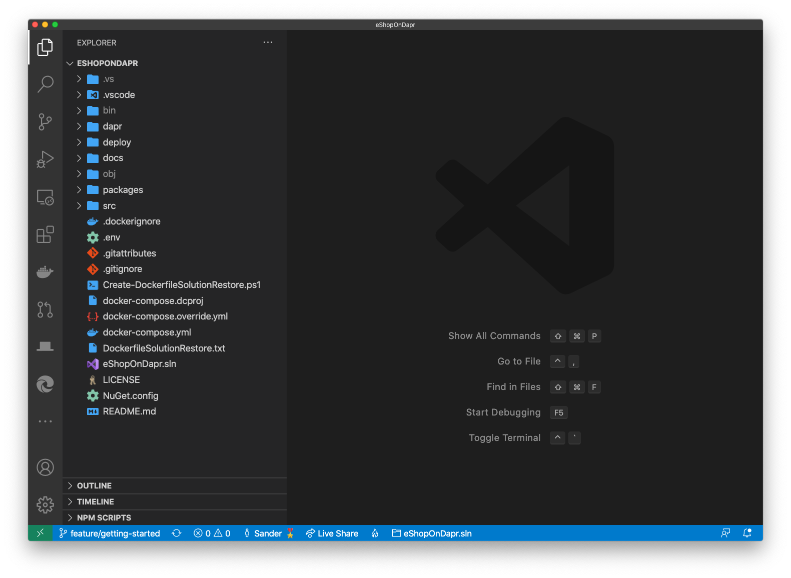
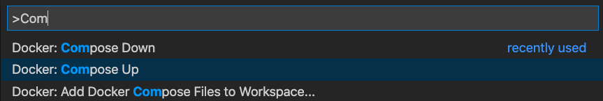
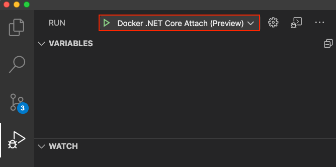

# Running eShopOnDapr

## Run eShopOnDapr from the CLI

The root folder of the repository contains [Docker Compose](https://docs.docker.com/compose/) files to run the solution locally. The `docker-compose.yml` file contains the definition of all the images needed to run eShopOnDapr. The `docker-compose.override.yml` file contains the base configuration for all images of the previous file.

To start eShopOnDapr from the CLI, run the following command from the root folder:

```terminal
docker-compose up
```

First Docker pulls the images. This can take some time to complete. Once the images are available, Docker will start the containers. You should now see the application logs in the terminal:



## Run eShopOnDapr from Visual Studio

Use Visual Studio to get the best F5 debugging experience. To start, open the `eShopOnDapr.sln` solution file in Visual Studio. Below you can see the full `eShopOnDapr.sln` solution opened in Visual Studio 2019:



The solution contains a Docker Compose project. Make sure it's set as the default startup project. Right-click on the `docker-compose` node in the Project Explorer, and select the *Set as StartUp Project* menu option:



Now you can build and run the application by pressing Ctrl+F5 or start debugging by pressing F5. You can also press the *Debug* button in the toolbar:



## Run eShopOnDapr from Visual Studio Code

To run eShopOnDapr from Visual Studio Code it's best to install the *C#* and *Docker* extensions.

Open the root folder in Visual Studio Code:



Open the command palette (Ctrl+Shift+P/Command+Shift+P) and select the *Docker: Compose Up* command:



Visual Studio Code will run docker compose to build and start the containers.

> Do *not* select *Compose Up* from the context menu of the `docker-compose.yml` file in the explorer. This will not work because Visual Studio Code does not include the associated `docker-compose.override.yml` file in the compose operation.

### Debugging with Visual Studio Code

Visual Studio Code supports attaching to containers for debugging. Once the application has started, go to the *Run* tab and click on the *Start Debugging* button with the  *Docker .NET Core Attach (Preview)* profile selected:



Visual Studio Code will ask you to select a container group. Choose *eshopondapr*.

Next, you can select the container you want to attach to. Select one of the .NET microservice containers.

Finally, Visual Studio Code will ask you if you want to copy the .NET Core debugger to the container. Select *Yes*.

The debugger is now attached to your container and you can set breakpoints in the code of the selected .NET microservice.

## Run eShopOnDapr on Kubernetes

To run eShopOnDapr on Kubernetes, you first need to set up a Kubernetes cluster, such as MiniKube or Docker for Desktop. Next, you need to install Dapr into it. See the [*Install Dapr into a Kubernetes cluster how-to*](https://docs.dapr.io/getting-started/install-dapr-kubernetes/) for details.

eShopOnDapr includes a [Helm](https://helm.sh/) chart for easy deployment to a Kubernetes cluster. Run the following command from the `deploy\k8s\helm` folder to install the Helm chart onto a local cluster:

```terminal
helm install myeshop .
```

If you want to install eShopOnDapr on a remote Kubernetes cluster (e.g. Azure Kubernetes Service), include the remote cluster IP in the Helm command:

```terminal
helm install --set externalDnsNameOrIP=<clusterIP> myeshop .
```

When running on Kubernetes, you can access the eShopOnDapr health UI at http://localhost:30007/healthchecks-ui.

When all microservices are healthy, you can navigate to http://localhost:30000 to view the eShopOnDapr UI.

To remove eShopOnDapr from Kubernetes, uninstall the Helm chart:

```terminal
helm uninstall myeshop
```
