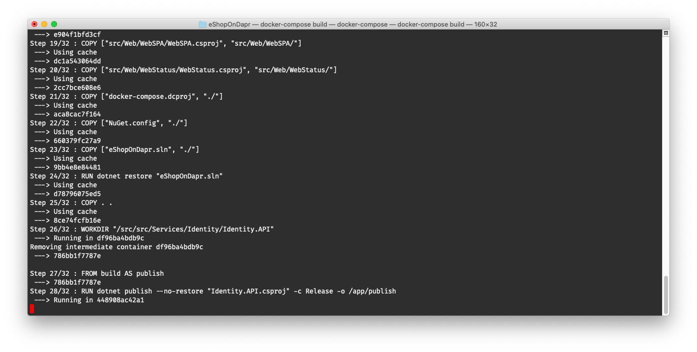

# Running eShopOnDapr

## Run eShopOnDapr from the CLI

The root folder of the repository contains [Docker Compose](https://docs.docker.com/compose/) files to run the solution locally. The `docker-compose.yml` file contains the definition of all the images needed to run eShopOnDapr. The `docker-compose.override.yml` file contains the base configuration for all images of the previous file.

To start eShopOnDapr from the CLI, run the following command from the root folder:

``` 
docker-compose up
```

First Docker builds the images. This can take between 10 and 30 minutes to complete, depending on the system speed.



Once the images have been built, Docker will start the containers. You should now see the application logs in the terminal:


## Run eShopOnDapr from Visual Studio

Use Visual Studio to get the best F5 debugging experience. To start, open the `eShopOnDapr.sln` solution file in Visual Studio. Below you can see the full `eShopOnDapr.sln` solution opened in Visual Studio 2019:


The solution contains a Docker Compose project. Make sure it's set as the default startup project. Right-click on the `docker-compose` node in the Project Explorer, and select the *Set as StartUp Project* menu option:


Now you can build and run the application by pressing Ctrl+F5 or start debugging by pressing F5. You can also press the *Debug* button in the toolbar:


## Run eShopOnDapr from Visual Studio Code

To run eShopOnDapr from Visual Studio Code it's best to install the *C#* and *Docker* extensions.

Open the root folder in Visual Studio Code:


To get started with Visual Studio Code, open the root folder 